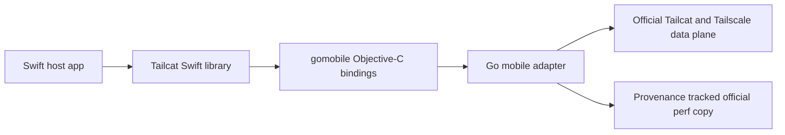

# Swift Tailcat design

This checkout implements a SwiftPM library with the **Tailcat** product: typed Swift 6 APIs wrap a small Go adapter, bound through gomobile Objective-C and distributed as a separate release-hosted XCFramework ZIP. The implementation uses official Tailcat at commit **b4dc28e8aa8936f0a90a41ad8293a64e3d6b645f**, module **v0.7.1-0.20260929145319-b4dc28e8aa89**. The repository is public `zshannon/swift-tailcat`; consumers add its `main` branch as shown in the README.

Start with the [README consumer workflow](../README.md#add-the-package-and-run-a-request), then the [typed request guide](Messaging.md) for streaming, errors and owner lifetime. This guide covers raw transport, configuration and maintainer architecture. The [coverage matrix](Coverage.md) maps inventoried public Go functions, exported types/fields, and CLI capabilities to current Swift operations. [UpstreamAPI.json](UpstreamAPI.json) and [UpstreamREADME.md](UpstreamREADME.md) preserve the root exported-function/method inventory and exact official README bytes from the frozen installed module recorded above and in Coverage.md. Automated updates refresh these snapshots; Coverage.md separately retains the last manually reviewed matrix baseline and marks review of a new pin pending. Features described here are implemented source behavior, subject to the matrix's explicit gaps and validation limits.

## Architecture

Swift consumers import `Tailcat`. `@Dependency(\.tailcat)` supplies the root; `makeSession(configuration:)` acquires a `Tailcat.Session` for raw transport and services. Applications exchange typed requests through `listen(configuration:isolation:port:handlers:)` and `connect(address:configuration:port:)`. Consumers do not run Go, gomobile, or download Go dependencies at runtime. `Package.swift` declares iOS 16/macOS 13 and Swift language mode 6. The package uses a public `binaryTarget(url:checksum:)` for the 0.0.1 release asset. Explicit maintainer mode `TAILCAT_LOCAL_ARTIFACT=1` selects the ignored `Artifacts/TailcatCore.xcframework.zip`. The binary includes device arm64, simulator arm64/x86_64, and macOS arm64/x86_64. Its byte count, SHA-256, toolchain, source hash, and Mach-O metadata are measured in the generated `Artifacts/manifest.json` and published as a separate release asset.

The adapter binds a small concrete protocol instead of upstream contexts, `net.Conn`, maps, unsigned ports, variadic options, or function-valued configuration. Swift sends validated JSON values to asynchronous Go operations and receives one completion callback. Byte fields use base64, durations/timestamps use signed nanoseconds, and resource IDs are runtime-owned opaque handles. Internal method names and error codes are documented in [Bridge/mobile/PROTOCOL.md](../Bridge/mobile/PROTOCOL.md); applications use typed Swift APIs.

`Tailcat.Failure` separates invalid input, closed state, unsupported platform capability and upstream/I/O failure; bridge cancellation maps to Swift `CancellationError`. A full TCP write that already made progress can wrap its cause, including cancellation, in `Tailcat.TCPConnection.WriteFailure`. Typed requests also expose `Tailcat.Messaging.Failure`, described in [Messaging.md](Messaging.md). The continuation state accepts completion exactly once, including cancellation races. Full DERP and status/path-discovery snapshots retain upstream JSON structure and unknown fields alongside typed common accessors. `Tailcat.JSONValue` represents numbers as Int64 when decodable that way and Double otherwise; it does not preserve arbitrary numeric precision, duplicate object keys, original formatting or byte-identical JSON. Typed `Tailcat.ConnectionInfo` maps the known pinned wire contract; `rawAddressFields` is available when preserving raw address fields matters.

Go performs blocking network I/O on goroutines. Async Swift requests suspend continuations rather than blocking an actor. Runtime close runs blocking bridge cleanup on a detached task. The `@unchecked Sendable` resource classes rely on bridge synchronization, locked Swift ownership state, and per-direction operation guards; this annotation does not authorize overlapping reads or writes on the same flow.

## Dependency environments

Declare an instance `@Dependency(\.tailcat)` after `import Tailcat`. Tailcat re-exports Dependencies, including the property wrapper and `withDependencies`; consumers only need the Tailcat package/product. Apps that already own a Dependencies dependency can retain their declaration and import: both paths use the same module and dependency values. In a normal live application context, the injected root supplies bridge-backed providers. Constructing the dependency itself starts no networking; each acquisition creates its own owned resource graph.

`Tailcat()` is an injectable stub with unimplemented providers. Dependencies selects that stub for tests and previews by default; those contexts do not automatically run the live bridge. Override `DependencyValues.tailcat` with providers appropriate to the test/preview, or explicitly select `.liveValue` when a test intentionally uses the bridge. An operation left unimplemented reports an issue and throws `Tailcat.Failure.unimplemented`. This does not change the public dependency API.

Construct the receiving instance inside the `withDependencies` operation so its property wrapper captures the intended values. Calling `Tailcat.liveValue` directly bypasses an override of `DependencyValues.tailcat`; reserve that explicit selection for bridge integration tests or deliberate manual configuration.

The re-export uses `@_exported public import Dependencies`, following [Point-Free's TCA facade](https://github.com/pointfreeco/swift-composable-architecture/blob/main/Sources/ComposableArchitecture/Internal/Exports.swift). `public import` alone does not re-export dependency names. Swift's underscored export attribute is compiler-internal; Dependencies and its own re-exported modules are part of this public source surface.

Handler registration captures the current Dependencies environment, which is restored during later invocation. Register within the override's scope if the handler must use that override. The listener builder executes in caller isolation; snapshot actor state there before capturing it in Sendable handlers. Persistent identity or cache storage is separate, optional host configuration rather than a prerequisite for dependency injection.

## Ownership and cancellation

A runtime owns all bridge handles. A server owns accepted TCP/UDP connections, listeners, managed services and their sessions; a client owns outgoing flows and its forwarding/SOCKS services. SSH owns SFTP and session resources, and SFTP owns persistent remote-file handles. Swift child resources retain the necessary Swift parent objects as well as the runtime. Accepted connections retain the server rather than the listener: closing a raw `Tailcat.TCPListener` or `Tailcat.UDPListener` stops future accepts while preserving already accepted children owned by Server. Closing a typed `Tailcat.Listener` closes its Session and active handlers too.

Use explicit `try await close()` on resources or the Session when work finishes. `requestShutdown()` starts interruption; the owning task must still join close. Typed `Tailcat.Listener` and `Tailcat.Connection` owners have their own joined close and request cancellation behavior, described in [Messaging.md](Messaging.md). It is idempotent and waits for cleanup; deinitialization is fallback cleanup, not an awaitable lifecycle guarantee. Runtime close invalidates descendants, cancels bridge operations, closes owned network resources and child processes, releases bridge callback references, and waits for admitted callbacks. Concurrent close callers join shared cleanup. Native resource-close operations execute and join even if their cancellation signal arrives before Begin; cancellation interrupts transports but completion preserves the actual cleanup result, including genuine failures. A child close also joins an already-started ancestor/runtime shutdown; handler cleanup avoids waiting on the parent that is waiting for that same handler. Resource close cancels/waits for operations referencing that resource or a closed descendant. Closing a service terminates its active sessions and owned processes.

Task cancellation cancels the associated Go operation. Cancellation of a TCP/UDP read or write applies a directional deadline; the connection may be reused after the cancelled operation completes, with deadlines reset as needed. One read and one write can run concurrently; overlapping operations within a direction are rejected. Cancellation of accept closes that listener, rather than consuming a future accepted connection. An accepted/dialed resource that loses the completion race is closed. If successful creation wins before cancellation, the returned resource is owned by the caller and must be closed.

`Tailcat.TCPConnection.write(_:)` completes the payload while holding one write-direction lease. `writeSome(_:)` performs one primitive write and returns its progress. Empty writes check cancellation and ownership, then return without invoking the provider. A provider must return positive progress no larger than the supplied bytes. `Tailcat.TCPConnection.WriteFailure` records bytes already written and the original cause; callers must not replay those bytes. Successful consumed read bytes win a cancellation race. Closure providers cooperate with operation cancellation; cancelling a read does not abort the entire flow.

Primitive async close callbacks and admitted acquisition providers cannot join their own or an ancestor's close; these joins throw `Tailcat.Failure.ownershipConflict`. Calling `requestShutdown()` again is safe. Cleanup diagnostics are delivered after the shared close outcome is completed so diagnostic callbacks cannot delay that outcome. Parent close joins admitted acquisitions through publication or unpublished-resource disposal, including injected providers. Live acquisition wraps allocation, conversion and ownership publication; unpublished handles are disposed and joined before cancellation or conversion failures escape.

SSH command/session cancellation, including channel creation and PTY requests, closes the owning SSH transport and sibling sessions. Upstream blocking channel requests and wait/read paths cannot reliably be interrupted by closing only the session. SFTP cancellation or SFTP-client close also closes the owning SSH transport and its SFTP/session resources: the upstream SFTP close protocol can otherwise wait indefinitely for a peer's reply. Ordinary remote-file close preserves the SFTP client; parent/runtime shutdown can interrupt a stalled file close. Local macOS processes are owned by the operation/service context and run in managed process groups; cancellation and parent close terminate them. TCP graceful drainage is a separate operation: `drainTCP()` waits for active TCP flows and supports task cancellation. A host that requires a timeout cancels its draining task at its deadline before proceeding to close.

Incoming async `Tailcat.Server.Handlers` run as tracked detached Swift tasks. The bridge owns the accepted flow until the handler returns, then closes it. Server/runtime close cancels these tasks and waits for them. **Cancellation is cooperative:** handlers must suspend in cancellable operations or check `Task.checkCancellation()`. A handler that ignores cancellation, blocks indefinitely, or loops without checking it can prevent close from returning. A handler must not await the close of its own server/runtime; close waits for that same handler to finish. Have a separate host task initiate shutdown.

Policy, connection selection, cache storage, log, and progress callbacks are synchronous on Go bridge threads. Cache callbacks run outside runtime/cache/server state locks. Return promptly; move heavier work into a separate task/queue with safely owned data. Do not synchronously block on an actor awaiting the bridge request. Do not synchronously close the callback's own resource/runtime, because close waits for admitted callbacks. Cache callbacks must not recursively start the server/client whose startup invoked them. Swift async handlers also cannot await their own parent close. Callback-selected policy data must be thread-safe and ready synchronously; async authorization should be prepared in the host before accepting traffic.

Perf progress callbacks receive live snapshots while the operation runs. Completion waits for admitted callbacks and releases the reference. Final results retain the newest 1024 ordered snapshots and report `progressDropped`; this is a bounded history, not an unbounded event queue. Raw `Tailcat.TCPListener.connections` and `Tailcat.UDPListener.connections` are pull-based `AsyncSequence` values, without background prefetch. Typed `Tailcat.Listener` manages its accept/handler tasks internally and exposes no `connections` sequence.

## Configuration, identity, and admission

Server configuration, policy and handlers are installed before startup. The adapter expands/selects regions with a cancellable context before calling upstream Start with an explicit region. Since raw upstream Start has no context, cancellation during final startup waits for cleanup. The adapter serializes lazy startup and makes repeated Swift start calls idempotent. Client creation is lazy until a dial or diagnostic operation needs the tunnel.

Keep WireGuard PSKs enabled unless legacy compatibility is an explicit requirement. A Tailcat address contains a secret PSK; `Tailcat.Identity.connectionInfo` is sensitive even though official JSON calls it `Public`. A stable server restores both node private key and PSK. Tailcat.Identity generation/import is separate from persistence. Hosts supply key material explicitly, optionally using `Tailcat.Identity.FileStore` with a selected directory and private file permissions. There is no automatic read of CLI `default`/`client-default` keys or global environment defaults.

Absent and empty lists have distinct meanings:

| Setting | `nil` | `[]` |
|---|---|---|
| `allowedClients` | Allow anyone who knows the Tailcat credential | Deny all client keys |
| `allowedProxies` | Allow any destination when forwarding is enabled | Deny all forwarded destinations |
| `servedTCPPorts` / `servedUDPPorts` | Let handlers decide direct ports | Filter direct ports except active listeners |

A supplied `Tailcat.Server.Policy` replaces corresponding list-based decisions. Its initializer's default closures allow traffic; configure both deliberately. A shareable `Tailcat.Server.ClientKeySet` captured by `allowClient` supplies Go's admission-only Add/Remove/Contains behavior: removing a key preserves existing clients. `revoke` is a stronger per-server convenience that removes permission first and then disconnects; `disconnect` alone preserves permission and a client can rejoin. The pinned upstream may retain established flow objects after peer removal; the adapter additionally suppresses server-owned flow traffic after revocation. It preserves blackholing/deadlines/cancellation rather than promising a reset packet.

Listeners take precedence over direct handlers and admit their ports through the filter. Handler selection gates a destination before delivering a resource; a missing/declining handler rejects TCP or drops UDP. `Tailcat.Server.Configuration.localPortHost` enables same-port TCP/UDP forwarding to an explicit local host, constrained by served-port filters. `server.forward(endpoint:port:transport:)` creates an independently owned mapping listener for a selected host:port, with an unused Tailcat tunnel port when zero. This differs from `client.forwardTCP` port-zero host binding, where the OS selects the local port. Exit-node and local mapping services use ordinary userspace sockets without changing system routes. Explicit destination policy and port filters remain host-controlled.

The upstream default DERP map is `https://tailcat.dev/derpmap.json`; custom region/map/URL/cache inputs are explicit. `Tailcat.Session.makeCache()` gives isolated memory storage; `makeCache(storage:)` accepts any synchronous thread-safe `Tailcat.Cache.Storage`. Clients/servers retain their configured cache, and cache/runtime close joins admitted callbacks. An explicitly closed cache supplies misses to existing consumers and rejects direct handle operations. Storage callbacks preserve bytes, opaque ETag and stored time; upstream controls one-hour freshness, conditional revalidation and stale fallback. Explicit `store` propagates storage-write errors; upstream fetch deliberately ignores them. `Tailcat.Cache.FileStorage(directory:)` persists paired URL-escaped JSON/ETag files in an explicit host directory with private permissions and atomic replacement, using JSON mtime for freshness. It chooses no global home/cache path. Upstream `Verbose` is process-wide and freezes when any runtime first uses networking; per-instance logs remain independently configurable.

Generic client TCP/UDP dialing accepts automatic/IPv4/IPv6 families and keeps upstream hostname/service-name resolution. Endpoint overloads take IP:port values. `Tailcat.Server.listenTCP(address:)` and `listenUDP(address:)` take a `Tailcat.TunnelListenAddress` with an optional typed host and numeric/service-name port. The public API uses an automatic native listener network and exposes no family argument; upstream rejects explicit IPv4 listener networks. `fetchDERPMap(cache:forServer:url:)` passes the HTTP server hint, and `resolve(_:cache:forServer:map:url:)` can expand without a network fetch. `Tailcat.DERPMap.region(matching:)` provides CLI code/name lookup with deterministic lowest-ID ambiguity resolution. The live `Tailcat.Client.forwardTCP(bind:port:)` and `forwardTCP(bind:endpoint:)` APIs supply an HTTP `service.url` for their host-local listener as a CLI formatting convention; it does not detect whether arbitrary forwarded TCP speaks HTTP. `Tailcat.Server.forward` returns its tunnel mapping address and port without populating `url`. Wildcard binds use loopback and IPv6 brackets survive. The host decides whether opening a browser is appropriate.

## SSH, files, and processes

`Tailcat.SSHService.Configuration` defaults to `.publicKeys([])` and denies all SSH users. `.none` is explicit tunnel-only authentication; empty authorized keys must never silently enable it. Authorized-key sources are loaded/validated before service creation, and unsupported authorized_keys options are rejected. Host keys are always required/pinned by the native Swift SSH client. Serving SSH returns the public host key so it can be exchanged explicitly; the private host key is persisted under the host container's `os.UserConfigDir()/tailcat/ssh`, matching upstream. There is no exported host-key path override. Tests isolate home/config in disposable processes.

`Tailcat.ResolvedDestination` retains whether an address came from DNS TXT. The destination-aware runtime SSH convenience probes public DNS destinations using a fresh node identity, no SSH credentials, and a pinned host key; it sends no command or PTY request and refuses accessible no-auth SSH by default. Overriding the refusal requires `permitPublicNoAuthentication: true`. Probe failures and the bounded ten-second probe timeout are nonfatal, as in the CLI, and the real connection still validates its pinned host key. A raw Client acquired with an address cannot infer DNS origin, so callers should use the destination-aware convenience for DNS names. The probe is a safety check, not proof that a public destination will remain safely configured.

Native SSH clients support command results, streaming sessions, PTY sizing, input EOF, resize and wait. Native SFTP supplies listing/stat/lstat/read/write/mkdir/remove/rename/chmod/times, persistent remote-file handles, and chunked multi-file recursive transfer. The server keeps official `os.Root` confinement and all four file modes. Flat drop boxes reveal no existing filenames; recursive write-only mode permits limited directory information and collision renaming. Persistent file handles keep all chunks of one drop-box upload in one server-selected file.

When `shell: true` and `files` is nil on macOS, upstream SFTP can access the filesystem with the shell user's permissions, resolving relative paths in the home directory. Supply a rooted `Tailcat.SSHService.FileService` for confinement. A nonempty forced `exec` excludes both shell and SFTP and receives `SSH_ORIGINAL_COMMAND` plus peer environment. `serveExec` is the inetd-style TCP alternative. Shell/PTY, forced/local exec and SOCKS-launched commands are macOS only; iOS/simulator fail with unsupported capability before launching. Portable SSH/SFTP protocol/file services remain available on iOS.

Swift upload/download helpers reject top-level symbolic-link inputs and every symbolic-link entry encountered recursively. They preserve modification time and permission bits when requested. Official CLI `cp` shells out to system `scp`; its other flags and metadata behavior are external-tool integration rather than Tailcat public-library capabilities. The portable native helpers do not promise full scp semantics or compression. The package does not read system SSH agents, configuration, or known_hosts automatically. Hosts supply UI, terminal input/output, key material, and permissions.

## Performance and test scope

The official `internal/perf` implementation and tests are copied at the pin because Go's internal-package rule prevents direct import. [PROVENANCE.md](../Bridge/internal/upstreamperf/PROVENANCE.md) records origin, and `Scripts/verify-upstream-copy.py` checks the copied `perf.go` implementation before builds; it does not verify `perf_test.go`. Both files retain the official source and license notices. No HerdrTailcat code or binaries are used.

`Tailcat.Performance.Parameters` exposes TCP/UDP, up/down/both, duration/bytes, stream count, payload length, bitrate and interval. Swift defaults differ from CLI defaults and are explicit in [Coverage.md](Coverage.md). Use `waitForDirectPath` and host cancellation to reproduce CLI direct-wait timeouts. Throughput refuses recognized shared Tailscale relay domains; `allowOwnedRelay: true` is explicit permission for an owned custom relay, not a way to benchmark public relays. Tests use a short local owned relay exercise; they establish protocol/accounting behavior, not production throughput or direct-path speed.

Tests use temporary rooted directories and owned loopback DERP/STUN/map/DNS endpoints. The Swift fixture script isolates SSH persistence and supplies `TAILCAT_FIXTURE_BIN`. Standard `swift test` runs Swift Testing and skips fixture integration without that environment. Go tests exercise encrypted transport, admission/revocation, custom callbacks, forwarding, SOCKS, cache behavior, files/SSH and local processes. No tests enroll external accounts, publish DNS, use shared relay throughput, or establish internet NAT traversal. The pinned stock CLI stream mode is exercised; other CLI modes and OpenSSH interoperability remain unverified.

The binary is compiled for all five listed Apple architectures. Runtime validation is macOS arm64 only. Device, simulator, macOS x86_64 and external-network validation remain separate work. iOS apps are responsible for app lifetime, local-network authorization and permitted file roots. Sandboxed macOS apps likewise need relevant entitlements/access. This library does not configure a network extension, system VPN, DNS, or routing table, and does not promise continuous iOS background service.

## Build, distribution, and provenance

`Scripts/build-xcframework.sh` pins Go 1.27.1 and x/mobile v0.0.0-20260908204917-8b95e45f8d3e through `environment.sh`, bootstraps task-local gomobile/gobind if necessary, verifies modules/copied perf, generates notices, and binds all five target architectures with deployment floors iOS16/macOS13, native build tags, `-trimpath`, and stripped binary flags. External toolchain/module downloads occur on the builder. System tools and consumer environments are not replaced.

The packaging script emits one compressed XCFramework ZIP and manifest. Ordered/timestamp-normalized packaging and pinned inputs improve repeatability; they do not prove independently rebuilt binary bytes are identical. Rebuild after bridge changes and verify the source hash, headers, Apple platform/architecture/minimum-OS metadata, Swift import/link, and fresh local consumer test. Archive size and checksums are manifest facts, not fixed prose.

Generated binaries stay outside Git. [Releases.md](Releases.md) describes explicit preparation, the exact initial 0.0.1 payload boundary and later manual releases. The initial publication requires main/tag to share one reviewed distribution source tree; ref actions are separate from local preparation. Later release preparation may generate a verified child commit changing only the package URL/checksum. The [manual verification workflow](../.github/workflows/verify.yml) rebuilds all slices with read-only permissions; workflows use no persistent caches or Actions artifact storage.

The wrapper license is [BSD-3-Clause](../LICENSE). [THIRD_PARTY_NOTICES.md](../THIRD_PARTY_NOTICES.md) and [DependencyInventory.json](DependencyInventory.json) describe the linked package graph, including generated mobile runtime support; the binary ZIP carries the license/notices, and the source ZIP includes the dependency inventory too. Official Tailcat/Tailscale and x/mobile BSD notices, WireGuard MIT notices, gVisor Apache requirements and other linked dependencies must remain attached to distribution. The source provenance, inventory and notice-generation checks are rebuild requirements, not a substitute for reviewing changes to the dependency graph.
